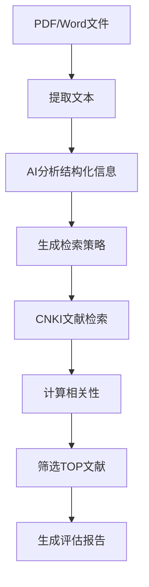
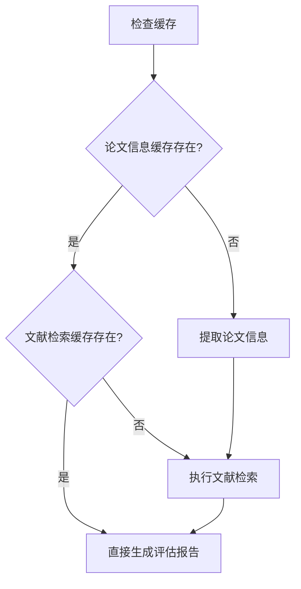

# 📚 基于缓存快速评估详解

## 🎯 什么是"基于缓存快速评估"？

**基于缓存快速评估** (`eval-cached`) 是系统提供的一个高效评估模式，它利用之前已经处理过的数据（缓存）来快速生成论文评估报告，而不需要重新执行耗时的处理步骤。

## ⚡ 为什么需要缓存评估？

### 🐌 传统完整流程的耗时操作：
1. **文档解析**: 从PDF/Word提取文本 (10-30秒)
2. **AI分析**: 提取结构化信息 (2-5分钟)
3. **文献检索**: 搜索相关论文 (3-10分钟)
4. **相关性计算**: 分析文献相关度 (1-3分钟)
5. **报告生成**: 生成最终评估报告 (30秒-1分钟)

**总耗时**: 6-19分钟

### ⚡ 缓存评估的优势：
- **跳过重复处理**: 直接使用已有数据
- **快速响应**: 通常30秒-2分钟完成
- **节省资源**: 减少AI调用和网络请求
- **一致性**: 基于相同的数据源

## 📊 缓存数据包含什么？

### 1. **论文结构化信息缓存**
**文件**: `{论文名}_pro_extracted_info.json`
```json
{
  "extracted_info": {
    "thesis_number": "论文编号",
    "title_cn": "中文标题", 
    "title_en": "英文标题",
    "author_cn": "作者姓名",
    "supervisor_cn": "导师姓名",
    "supervisor_en": "Supervisor Name",
    "abstract_cn": "中文摘要",
    "keywords_cn": "关键词",
    "university_cn": "大学名称",
    // ... 其他33个字段
  },
  "metadata": {
    "extraction_time": "2025-08-21T21:39:21.337185",
    "method": "pro_strategy",
    "extractor_version": "2.0",
    "stats": {
      "total_fields": 33,
      "extracted_fields": 18,
      "confidence": 0.82,
      "processing_time": 371.89,
      "discipline": "engineering"
    }
  }
}
```

### 2. **文献搜索结果缓存**
**文件**: `{论文名}_TOP30PAPERS_Chinese.json`、`{论文名}_TOP30PAPERS_English.json`
```json
[
  {
    "title": "相关论文标题",
    "authors": ["作者1", "作者2"],
    "abstract": "论文摘要",
    "publication_year": 2023,
    "journal": "期刊名称",
    "relevance_score": 0.85,
    "keywords": ["关键词1", "关键词2"]
  }
  // ... 更多相关文献
]
```

### 3. **文献元数据分析缓存**
**文件**: `{论文名}_literature_metadata_analysis.json`
```json
{
  "analysis_summary": "文献分析总结",
  "research_trends": "研究趋势分析", 
  "methodology_distribution": "方法论分布",
  "temporal_analysis": "时间分布分析"
}
```

## 🔄 评估模式对比

### 📈 完整评估流程 (`evaluate`)

**耗时**: 6-19分钟

### ⚡ 基于缓存评估 (`eval-cached`)

**耗时**: 30秒-2分钟

## 🎮 使用方法

### 1. **检查缓存状态**
```bash
uv run thesis-eval eval-cached --check-cache data/input/论文.pdf
```
**输出示例**:
```
📊 缓存状态检查:
   论文信息缓存: ✅ 已缓存
   文献搜索缓存: ✅ 已缓存  
   缓存文件数量: 3 个
     🎯 thesis_info_pro: 0.08 MB [专家版优先]
     📚 search_results_Chinese: 1.2 MB
     📚 search_results_English: 0.9 MB
```

### 2. **执行快速评估**
```bash
uv run thesis-eval eval-cached data/input/论文.pdf
```

### 3. **强制重新处理特定部分**
```bash
# 强制重新提取论文信息，但使用缓存的文献数据
uv run thesis-eval eval-cached --force-extract data/input/论文.pdf

# 强制重新搜索文献，但使用缓存的论文信息
uv run thesis-eval eval-cached --force-search data/input/论文.pdf
```

## 📋 缓存评估的工作流程

### Step 1: 缓存检测
```
🔍 检查论文信息缓存: {论文名}_pro_extracted_info.json
🔍 检查文献搜索缓存: {论文名}_TOP30PAPERS_*.json
```

### Step 2: 数据加载
```
✅ 加载缓存的专家版论文信息
   提取时间: 2025-08-21T21:39:21.337185
   提取方法: pro_strategy
   
✅ 加载中文文献: 30 篇
✅ 加载英文文献: 25 篇
```

### Step 3: 快速评估
```
📝 正在生成Markdown评估报告...
📊 正在生成文献综述深度分析报告...
✅ 评估完成
```

## 🎯 适用场景

### ✅ 推荐使用缓存评估的情况：
- **重复评估**: 需要多次查看同一论文的评估结果
- **格式转换**: 需要不同格式的输出 (Markdown ↔ JSON)
- **快速预览**: 快速查看论文分析结果
- **批量处理**: 对已处理过的论文进行批量报告生成
- **演示展示**: 需要快速展示系统功能

### ⚠️ 需要完整评估的情况：
- **首次处理**: 新论文从未被系统分析过
- **数据更新**: 需要最新的文献检索结果
- **质量验证**: 验证之前的分析结果

## 💡 性能对比

| 项目 | 完整评估 | 缓存评估 | 提升倍数 |
|------|----------|----------|----------|
| **处理时间** | 6-19分钟 | 30秒-2分钟 | **5-20倍** |
| **AI调用次数** | 10-50次 | 0-2次 | **减少95%** |
| **网络请求** | 100-500次 | 0次 | **减少100%** |
| **资源消耗** | 高 | 极低 | **减少90%** |

## 🔧 高级用法

### 1. **批量缓存评估**
```bash
# 对多个已处理过的论文进行快速评估
uv run thesis-eval eval-cached data/input/*.pdf
```

### 2. **混合模式**
```bash
# 使用缓存的论文信息，但重新搜索最新文献
uv run thesis-eval eval-cached --force-search data/input/论文.pdf
```

### 3. **验证模式**
```bash
# 重新提取论文信息进行对比验证
uv run thesis-eval eval-cached --force-extract data/input/论文.pdf
```

## 📊 总结

**基于缓存快速评估** 是一个智能的评估模式，它：

✅ **大幅提升效率**: 5-20倍速度提升
✅ **节省资源**: 减少95%的计算消耗  
✅ **保证质量**: 基于相同高质量数据源
✅ **灵活控制**: 支持选择性更新
✅ **用户友好**: 自动检测和提示缓存状态

这使得用户可以快速获得论文评估结果，特别适合需要重复查看、格式转换或快速展示的场景。
