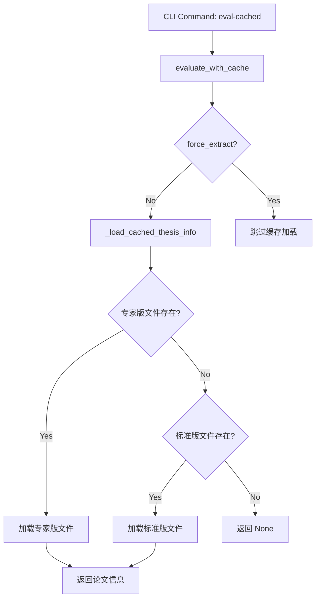

# _pro_extracted_info.json 加载时机和位置分析报告

## 🎯 概述

`_pro_extracted_info.json` 文件是专家版论文提取结果的缓存文件，系统在特定的时机和位置会加载这些文件。

## 📍 加载位置和调用链

### 1. **主要加载函数**

**位置**: `src/thesis_inno_eval/cached_evaluator.py`
**函数**: `_load_cached_thesis_info()`

```python
def _load_cached_thesis_info(self, base_name: str, force_extract: bool = False) -> Optional[Dict]:
    """加载缓存的论文结构化信息 - 优先加载专家版"""
    
    # 优先查找专家版文件
    pro_info_file = self.output_dir / f"{base_name}_pro_extracted_info.json"
    standard_info_file = self.output_dir / f"{base_name}_extracted_info.json"
```

**加载优先级**:
1. 🎯 `{base_name}_pro_extracted_info.json` (专家版 - 优先)
2. 📁 `{base_name}_extracted_info.json` (标准版 - 备用)

### 2. **调用链追踪**

#### 📍 **Level 1: CLI 命令入口**

**命令**: `uv run thesis-eval eval-cached`
**位置**: `src/thesis_inno_eval/cli.py:110`

```python
@cli.command()
def eval_cached(files, output_format, force_search, force_extract, check_cache):
    """基于缓存数据快速评估论文 (推荐使用)"""
```

#### 📍 **Level 2: 评估执行**

**位置**: `src/thesis_inno_eval/cli.py:154`

```python
result = evaluator.evaluate_with_cache(
    file_path, ai_client, session_id,
    force_search=force_search,
    force_extract=force_extract,
    output_format=output_format
)
```

#### 📍 **Level 3: 缓存加载**

**位置**: `src/thesis_inno_eval/cached_evaluator.py:52`

```python
# 1. 加载缓存的结构化信息
thesis_info = self._load_cached_thesis_info(base_name, force_extract)
```

#### 📍 **Level 4: 文件读取**

**位置**: `src/thesis_inno_eval/cached_evaluator.py:108`

```python
with open(info_file, 'r', encoding='utf-8') as f:
    data = json.load(f)
```

## ⏰ 加载时机

### 🚀 **主要触发场景**

#### 1. **eval-cached 命令**
```bash
# 基于缓存的快速评估
uv run thesis-eval eval-cached 文件路径
```

**何时加载**:
- 每次执行 `eval-cached` 命令时
- 优先查找专家版缓存文件
- 如果专家版不存在，回退到标准版

#### 2. **缓存状态检查**
```bash
# 检查缓存状态
uv run thesis-eval eval-cached --check-cache 文件路径
```

**何时检查**:
- 使用 `--check-cache` 参数时
- 显示专家版和标准版文件的存在状态

#### 3. **强制提取模式**
```bash
# 强制重新提取时不加载缓存
uv run thesis-eval eval-cached --force-extract 文件路径
```

**何时不加载**:
- 使用 `--force-extract` 参数时跳过缓存加载
- 直接执行新的提取操作

### 🔄 **加载流程**



## 📂 文件路径构造

### **专家版文件路径**
```python
pro_info_file = output_dir / f"{base_name}_pro_extracted_info.json"
```

### **示例路径**
- 输入: `data/input/50193.docx`
- 输出: `data/output/50193_pro_extracted_info.json`

## 🔍 缓存状态检查

**位置**: `src/thesis_inno_eval/cached_evaluator.py:348`

```python
def get_cache_status(self, file_path: str) -> Dict:
    # 检查论文信息缓存 - 优先检查专家版
    pro_thesis_info_file = self.output_dir / f"{base_name}_pro_extracted_info.json"
    standard_thesis_info_file = self.output_dir / f"{base_name}_extracted_info.json"
```

## 📊 实际使用示例

### **成功加载专家版的日志输出**
```
✅ 加载缓存的专家版论文信息: data\output\50193_pro_extracted_info.json
   提取时间: 2025-08-21T21:39:21.337185
   提取方法: pro_strategy
```

### **缓存状态检查输出**
```
💾 缓存状态检查:
   论文信息缓存: ✅ 已缓存
   缓存文件数量: 1 个
     🎯 thesis_info_pro: 0.08 MB [专家版优先]
```

## 🎯 关键特性

### ✅ **优先级机制**
1. **专家版优先**: 始终优先查找和加载专家版文件
2. **向后兼容**: 专家版不存在时回退到标准版
3. **明确标识**: 日志中清晰标识加载的文件类型

### ✅ **数据验证**
```python
# 验证必要字段 - 更新字段名称适配新格式
required_fields = ['title_cn', 'abstract_cn']
missing_fields = [f for f in required_fields if not extracted_info.get(f, '').strip()]
```

### ✅ **错误处理**
- 文件不存在时的优雅降级
- JSON 解析错误的异常处理
- 详细的日志记录

## 📝 总结

**专家版 `_pro_extracted_info.json` 文件的加载发生在**:

🎯 **何时**: 
- 执行 `eval-cached` 命令时
- 检查缓存状态时
- 需要论文结构化信息进行评估时

🎯 **何地**:
- `cached_evaluator.py` 的 `_load_cached_thesis_info()` 函数
- 通过 `evaluate_with_cache()` 方法调用
- CLI 的 `eval_cached` 命令触发

🎯 **优先级**:
- 专家版文件具有最高优先级
- 系统自动选择最佳可用版本
- 确保数据的完整性和准确性
